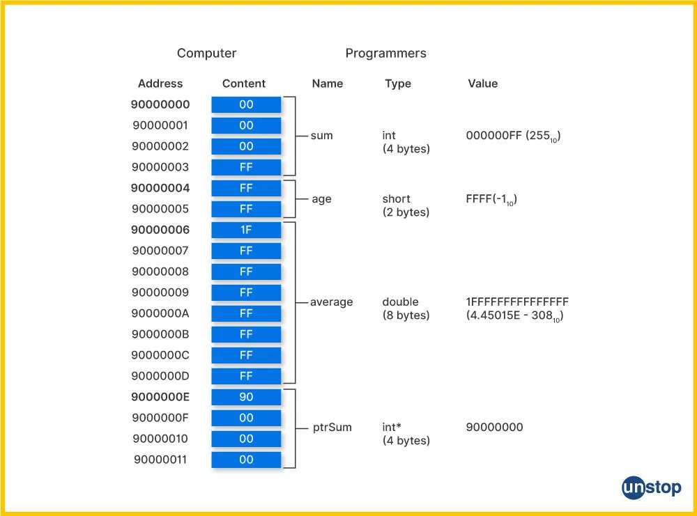
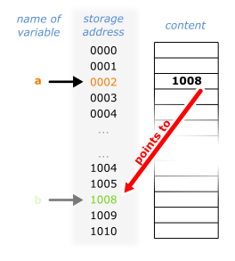

# Les pointeurs

## La notion d'adresse

```c
#include <stdio.h>

int main(void) {
	int val = 42;
	printf("Value: %d\n", val);
	printf("Memory Address: %p\n", &val);
	printf("Size in Bytes: %zu\n", sizeof(val));
	return 0;
}
```




```c
#include <stdio.h>

int main(void) {
	int b = 42;
	printf("Value: %d\n", b);
	printf("Memory Address: %p\n", &b);
	printf("Size in Bytes: %zu\n", sizeof(b));

// on va créer une variable pointeur `a` qui va pointer à l'adresse de `b`
    int *a = &b;
	printf("Valeur de a %p\n", a);
	printf("Valeur de la valeur pointée par a: %d\n", *a);
	return 0;
}
```
## Commentaire du programme ci-dessus
On commence par déclarer et initialiser un entier `b` à 42.
On imprime ensuite ça valeur avec `printf("Value: %d\n", b);`
Par la suite on s'intéresse à **l'adresse de b** que l'on récupère avec **`&b`**.
On imprime aussi **la taille de b** (en octets), donnée par **`sizeof(b)`**.

Après dans la deuxième partie du programme on crée une autre variable.
Il s'agit cette fois d'un pointeur que l'on nomme `a` (il s'agit d'une variable **de type `int *`**, c'est à dire **un pointeur de type entier**).
On imprime la valeur stockée dans `a`. Celle-ci est en effet l'adresse de `b`.
Enfin on s'interesse à l'accès à la valeur de b **mais indirecement**, c'est à dire **en passant par son d'adresse**.
Pour le faire on utilise l'opérateur de **déréférencement** `*`.
`*a` nous renvoie en effet la valeur de `b` mais en passant par son adresse qui est elle contenue dans `a`.




