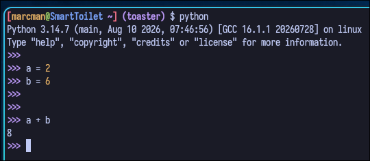
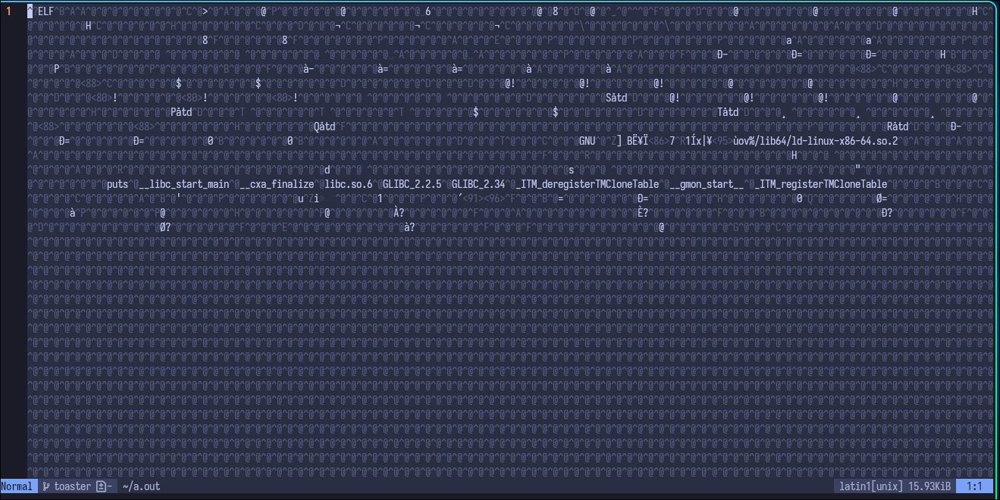

# Introduction

## Langage interprété vs compilé

### Interprété
Traduit du code en langage machine ***à la volée***, c-a-d ***pendant l'exécution***.
- python
- mathlab
- bash



### Compilé
Traduit du code en langage machine ***en compilation***, c-a-d ***avant l'exécution***.
- c/c++
- rust
- go

```bash
gcc mon_programme.c
```



### JIT Compilé (à titre indicatif)
Mélange des deux: commencer par ***exécuter à la volée*** puis ***compiler les parties fréquentes***.
- JavaScript
- Java

## Contrôle explicite de la mémoire
Python ***fait des choix*** de gestion de mémoire automatiquement en manipulant des objets.
Ces choix sont souvent pas appropriés pour des systèmes critiques (défense, aéronautique, médical, transports).

> [!NOTE]
> **Exemple:**
> Python utilise souvent de la mémoire allouée dynamiquement.
> Cette méthode d'allocation de mémoire est souvent évitée dans certaines applications due à son temps d'exécution imprédictible (WCET).

Les langages systèmes comme le c forcent au programmeur à travailler avec la mémoire directement, ***offrant un contrôle absolu*** sur celle-ci.
