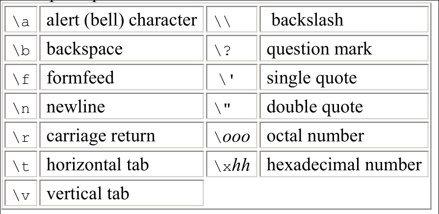

Une partie du tableau ASCII vu précédemment correspond aux ***caractères de contrôle***.

# Caractères de contrôle
Les deux caractères de contrôle à connaitre:
- Le ***line feed (LF)*** (Nouvelle Ligne)
- Le ***Carriage Return (CR)*** (Retour Chariot)

Pour spécifier certains caractères de contrôle on utilise des séquences d'échape.
Ces caractères semble constituer deux mais en réalité en forment uniquement un.

Par exemple:
- le ***line feed***: `\n`
- le ***carriage return***: `\r`



On utilisera le `\n` pour aller à la ligne suivante ou le `\r` pour revenir au début de la ligne dans des fonctions type `printf`.

>[!NOTE]
>**Par exemple:**
> ```c
> printf("Ces mots sont à la première ligne,\net celà sont sur la deuxième\n")
> ```
>

# L'opérateur sizeof

L'opérateur sizeof permet de mesurer la **taille de variables**
```c
	int a = 2;
	size_t taille_variable = sizeof a;
	printf("Taille de la variable a: %zu octets (ou bytes)\n",
	       taille_variable);
```

Mais aussi **des types**
```c
	size_t taille_type = sizeof(short);
	printf("Taille du type 'short': %zu octets (ou bytes)\n", taille_type);
```

# La fonction printf
La fonction `printf` vient de 'print-format'.
C'est une fonction qui permet non seulement d'imprimer des caractères sur un écran mais aussi de formater des données.
Pour choisir le format des données, l'utilisateur de la fonction pourra spécifier celui-ci dans un spécificateur précédé par le symbole '%'.

> [!NOTE]
> Parmi ceux-là on trouve par exemple:
> 'd' pour les nombres entiers signés et 'u' pour les nombres entiers non signés (toujours positifs).

>[!IMPORTANT]
> D'autres paramètres peuvent être indiqués comme par exemple la longueur.
> Ceux là permettent de compléter le spécificateur.
> Pour formater correctement le type `size_t` on utilise le `z` pour la longueur combiné avec `u` puisqu'une taille de mémoire est toujours positive.
> Par exemple:
> ```c
>	int foo = 2;
>	printf("Quantité de mémoire alouée par la variable 'foo': %zu\n",
>	       sizeof foo);
> ```

