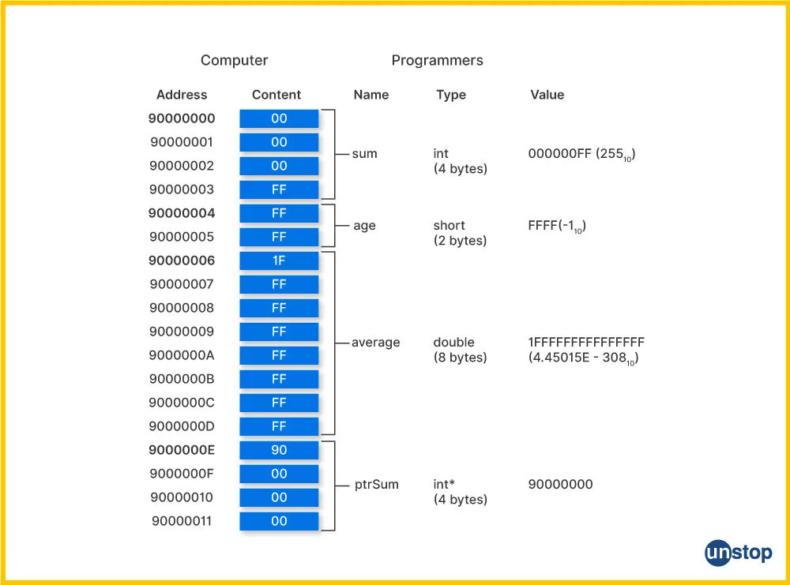
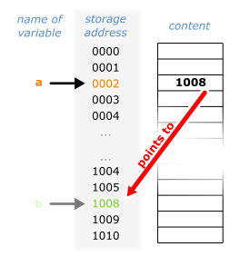

# Les pointeurs

## La notion d'adresse

```c
#include <stdio.h>

int main(void) {
	int val = 42;
	printf("Value: %d\n", val);
	printf("Memory Address: %p\n", &val);
	printf("Size in Bytes: %zu\n", sizeof(val));
	return 0;
}
```




```c
#include <stdio.h>

int main(void) {
	int b = 42;
	printf("Value: %d\n", b);
	printf("Memory Address: %p\n", &b);
	printf("Size in Bytes: %zu\n", sizeof(b));

// on va créer une variable pointeur `a` qui va pointer à l'adresse de `b`
    int *a = &b;
	printf("Valeur de a %p\n", a);
	printf("Valeur de la valeur pointée par a: %d\n", *a);
	return 0;
}
```




