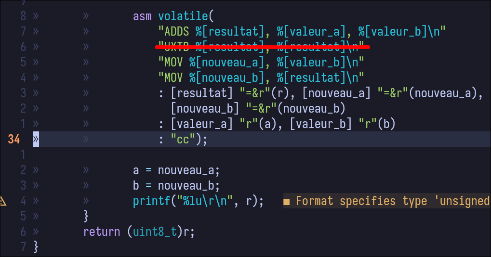
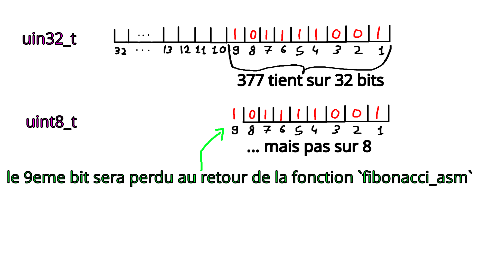
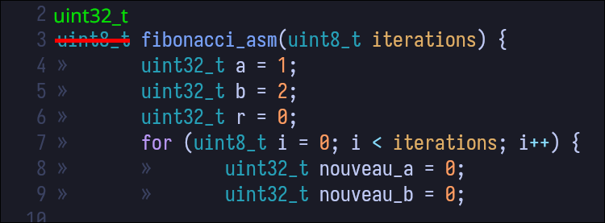

## Détermination d'une source d'erreur à l'aide des registres
Pour localiser l'erreur on peut ajouter un point d'arrêt au début du bloc assembleur.
Il suffit d'exécuter chaque itération de la boucle, une à la fois en appuyant sur `continue` (le bouton *play*) jusqu'à qu'on ait exécuter les 10 premières itérations de la boucle.

Une fois qu'on soit au début de la 11ème boucle, on va ouvrir la vue disasemblage pour exécuter instruction par instruction et observer les registres suite à l'exécution de chaque instruction.
On observe qu'après l'instruction ADDS de somme, celui-ci est juste et on obtient bien 377 comme résultat.
Mais à l'instruction suivante (UXTB), on tronque le résultat sur 8 bits et on obtient 121.

[Video explicative du débogage](https://marcrobison.com/debogage.mp4)

Pour corriger on enlève la ligne avec l'instruction UXTB.

## Détermination de la deuxième source d'erreur
La deuxième source d'erreur provient de la valeur de retour.
En effet 8 bits ne suffisent pas pour stocker 377.

Pour corriger on change le type de la variable de retour en `uint32_t`:

## Vérification de fonctionnement:
On vérifie:

1. Le fonctionnement du programme après avoir complété les instructions assembleur à trous.
2. Le fonctionnement du programme après avoir corrigé une des erreurs:
La troncation avec l'instruction UXTB (ligne 28 du programme `apres_completion_trous.c`).

Étant donné qu'on imprime la valeur avant la sortie de la fonction (ligne 38), celle-ci affiche la valeur attendue, comme le programme `fibonnacci_c` (377).

[Video vérification du fonctionnement du programme](https://marcrobison.com/verification_fonctionnement_fibo.mp4)
